  

  J'aime créer de nouvelles choses, du code jusqu'à la prod. 
  🔐 En ce moment : j'apprends la cybersécurité.

  
  
  
  
  
  
   
  
  
  
  
  
   
  
  
  
  
  
  

  

## Projets

<table>
  <tr>
    <td width="50%" valign="top">
      <h3><a href="https://github.com/QAliker/PulseScore">⚽ PulseScore</a></h3>
      Scores de foot en temps réel : classements, compos, stats joueurs. 
      NestJS · Next.js · Redis · Prisma · PostgreSQL · Docker
    </td>
    <td width="50%" valign="top">
      <h3><a href="https://github.com/QAliker/MoodFlow">🌊 MoodFlow</a></h3>
      Suivi d'humeur avec prédictions et suggestions d'activités. 
      Laravel · Nuxt · temps réel · Chart.js · Docker
    </td>
  </tr>
</table>

🎸 musicien · 🎮 jeux vidéo · ⚽ sport

<picture>
  <source media="(prefers-color-scheme: dark)" srcset="https://raw.githubusercontent.com/QAliker/QAliker/output/github-snake-dark.svg">
  
</picture>
